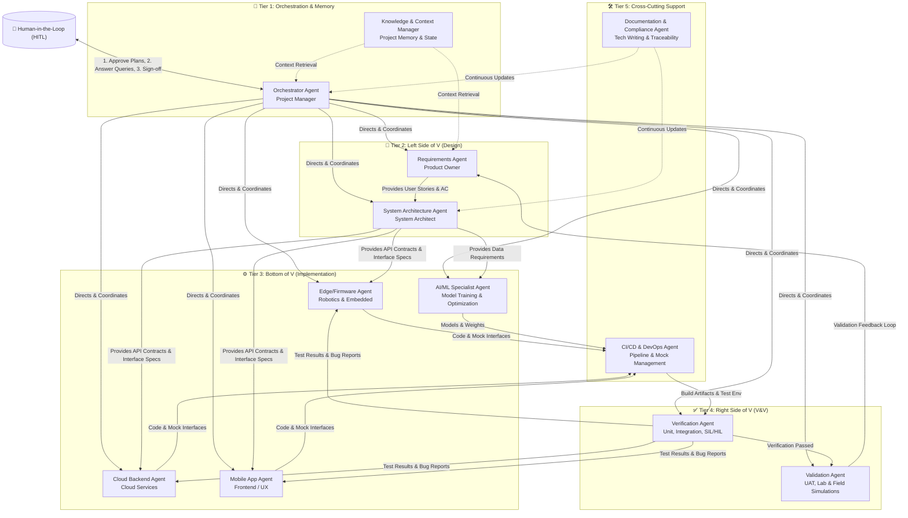
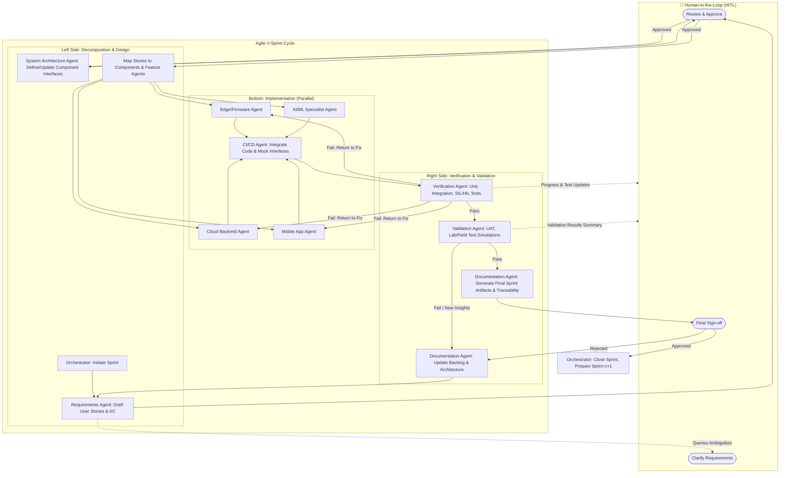
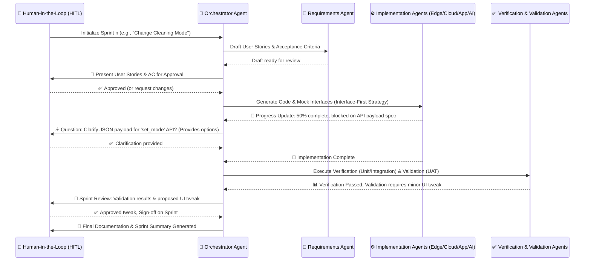

Make a plan for the implementation of the AI Agents as described below:

My prompt to AI: Read https://aiotplaybook.org/index.php?title=Agile_V-Model

Define the AI agents needed to support a fully AI development of a product like the ACME:Vac Vacuum Cleaner used as an example in the article.
The development shall be done in Claude Code or VS GitHub Copilot using a hierarchy of agents that takes care of everything in the product development from planning to architecture designs, requirements engineering,documentation, verification, validation etc.
The agents shall communicate progress and questions to the human in the loop.

Make a visual overview of the needed agents and how the are interacting.

The answer from the AI:

Based on the **Agile V-Model** article and the **ACME:Vac** smart vacuum cleaner example, developing such a complex AIoT (Artificial Intelligence of Things) product requires a structured, multi-agent AI system. The ACME:Vac spans edge robotics (sensors, VSLAM/LIDAR, motor control), cloud backend (map management, user config), and mobile applications, all requiring rigorous Verification & Validation (V&V).

Below is the comprehensive definition of the AI agent hierarchy, their interaction protocols, and visual Mermaid diagrams designed for execution in environments like **Claude Code** or **VS Code with GitHub Copilot**.

---

### 1. AI Agent Hierarchy Definition

To achieve "fully AI development" while maintaining the rigor of the Agile V-Model, the agents are organized into a hierarchical, role-based structure. Each agent can be instantiated as a specialized prompt/workspace context in Claude Code or Copilot.

#### **Tier 1: Orchestration & Human Interface**
*   **Orchestrator Agent (Scrum Master / Project Manager)**: The central brain. It manages the "v-sprint" lifecycle, delegates tasks to specialized agents, maintains the global project state, and serves as the **sole communication bridge to the Human-in-the-Loop (HITL)**. It escalates blockers, requests approvals, and summarizes progress.
*   **Knowledge & Context Manager**: Maintains the "memory" of the project. It stores and retrieves the Story Map, Component Architecture, API contracts, and past sprint retrospectives to ensure consistency across all agents.

#### **Tier 2: Left Side of the "V" (Decomposition & Design)**
*   **Requirements Engineering Agent (Product Owner)**: Translates high-level epics into granular User Stories and Acceptance Criteria (AC). For ACME:Vac, it defines stories like *"As a user, I want to switch to 'Carpet Boost' mode via the app"*. It maps stories to specific components.
*   **System Architecture Agent**: Enforces an **interface-first strategy**. It defines and updates the Component Architecture (Edge, Cloud, App), data models, and API contracts (e.g., REST/gRPC specs) so implementation agents can work in parallel using mockups.

#### **Tier 3: Bottom of the "V" (Implementation)**
*   **Edge/Firmware Agent**: Develops embedded C/C++/Rust code, sensor integration (LIDAR, cliff sensors), and hardware abstraction layers for the robot.
*   **Cloud Backend Agent**: Develops scalable cloud services, databases (for map/history data), and remote robot control APIs.
*   **Mobile App Agent**: Develops the smartphone application (e.g., React Native/Swift/Kotlin), UI/UX, and client-side state management.
*   **AI/ML Specialist Agent**: Handles data pipeline creation, model training (e.g., obstacle detection, VSLAM optimization), and edge deployment of ML models.

#### **Tier 4: Right Side of the "V" (Verification & Validation)**
*   **Verification Agent (QA Engineer)**: Focuses on *"Are we building the product right?"*. Generates and executes unit tests, integration tests, and Software-in-the-Loop (SIL) / Hardware-in-the-Loop (HIL) simulations. Checks code against the micro-level Acceptance Criteria.
*   **Validation Agent (Test Architect)**: Focuses on *"Are we building the right product?"*. Designs and simulates User Acceptance Tests (UAT), lab tests, and field test scenarios. Validates against the macro-level Definition of Done (DoD).

#### **Tier 5: Cross-Cutting Support**
*   **CI/CD & DevOps Agent**: Manages the automated pipelines, builds, mock service deployments, and continuous testing (CT) infrastructure.
*   **Documentation & Compliance Agent**: Continuously generates and updates architecture diagrams, API documentation, user manuals, and safety traceability matrices (crucial for regulated AIoT products).

---

### 2. Human-in-the-Loop (HITL) Communication Protocol

The agents must not operate in a black box. The **Orchestrator Agent** is programmed to interrupt and engage the HITL at specific gates:
1. **Planning Gate**: Presents drafted User Stories and Architecture changes for approval before coding begins.
2. **Blocker/Clarification Gate**: If an Implementation Agent encounters ambiguous requirements or conflicting API specs, the Orchestrator pauses the sprint and asks the HITL a specific, multiple-choice or short-answer question.
3. **V&V Review Gate**: Presents a summary of Verification/Validation results, highlighting any failed tests or UAT feedback requiring backlog adjustments.
4. **Sprint Sign-off**: Requests final human approval to merge the sprint increment into the main production branch and update the baseline documentation.

---

### 3. Visual Overview: Agent Hierarchy

This diagram illustrates the organizational structure and data flow between the AI agents and the Human-in-the-Loop.

---

### 4. Visual Overview: Agile V-Sprint Interaction Flow

This flowchart demonstrates how the agents execute a single "v-sprint" (e.g., implementing the "Change Cleaning Mode" feature), including the mandatory HITL checkpoints.

---

### 5. Visual Overview: HITL Communication Sequence

This sequence diagram explicitly details how the Orchestrator manages communication with the human developer, ensuring the human is only bothered with high-value decisions and clear progress updates.

---

### 6. Implementation Guide for Claude Code / VS GitHub Copilot

To make this hierarchy functional in a real IDE:

1. **Workspace Structure**: Create a root directory with subfolders for each agent's domain (e.g., `/edge`, `/cloud`, `/app`, `/docs`, `/tests`).
2. **Agent Prompt Files**: Create a `.prompt` or `CLAUDE.md` / `.github/copilot-instructions.md` file in each subfolder defining the specific agent's role, constraints, and output format. For example, the `Verification Agent` prompt would explicitly state: *"You are the Verification Agent. Your goal is to generate unit and integration tests for the ACME:Vac. Always check against the Acceptance Criteria in `/docs/requirements.md`."*
3. **Orchestrator as the Entry Point**: The human should primarily interact with a master `Orchestrator.md` prompt. When you give a high-level command (e.g., "Start Sprint 1: Carpet Boost Mode"), the Orchestrator uses the IDE's codebase search and multi-file editing capabilities to sequentially trigger the Requirements, Architecture, and Implementation agents.
4. **Interface-First Mocking**: Instruct the Implementation Agents via prompt to *"If a dependent component is not ready, generate a mock service or stub interface that satisfies the API contract defined by the System Architecture Agent, allowing CI/CD to proceed."*
5. **HITL Checkpoints**: Configure the Orchestrator to end its generation with explicit `[AWAITING HUMAN APPROVAL]` blocks when architectural decisions or V&V failures occur, preventing the AI from blindly propagating errors.