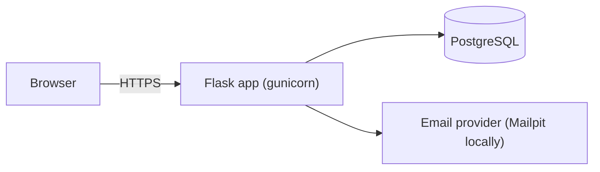

# Components — {{PROJECT_NAME}}

<!-- Owned by the system-architect. Keep the diagrams in Mermaid. -->

## Component model

| Component | Code | Responsibility | Interfaces |
|---|---|---|---|
| health | `app/blueprints/health.py` | Liveness and database connectivity | IF-001 |
| main | `app/blueprints/main.py` | Landing page | — |

## Story → interface mapping
| Story | Interfaces / routes |
|---|---|

## Deployment topology
| Environment | Runtime | Database | Secrets | URL |
|---|---|---|---|---|
| dev (local) | docker compose | postgres:16 container | `.env` | http://localhost:8000 |
| staging | <container service> | <managed PostgreSQL> | <key vault> | <url> |
| prod | <container service> | <managed PostgreSQL, PITR backups> | <key vault> | <url> |

## NFR budgets
| NFR | Budget | Measured by |
|---|---|---|
